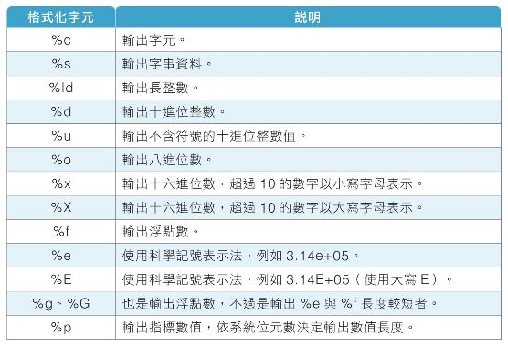

<h1 align="center">
   
  [專題作品]網路爬蟲-兌換外匯小程式
</h1>

  使用網路爬蟲技術 (urllib.request/bs4)，自動抓取目前臺灣銀行的外匯資料，使用者輸入欲兌換的 (1)臺幣金額 與 (2)貨幣種類，即可計算出兌換後的該貨幣金額。
     
  <strong><em>外匯相關資料，請參考臺灣銀行網站：</em></strong>  https://rate.bot.com.tw/xrt?Lang=zh-TW

## 目錄
* [簡介](#簡介)
* [專案演練](#專案演練)
* [設備與環境](#設備與環境)
* [聯繫方式](#聯繫方式)
* [致謝](#致謝)
* [權限](#權限)

## 簡介

## 專案演練
* pass

## 設備與環境
###電子設備/作業系統
* OS: Windows 7
* CPU: Intel(R) Core(TM) i5-4430 CPU @ 3.00GHz
* RAM: 8.00 GB

###開發軟體/套件版本
* Python: 3.10.1
* urllib3: 1.26.4
* beautifulsoup4 4.9.3

## 聯繫方式
👤 **Larry**
  * Github: https://github.com/Larry30500
  * Email: larry30500@gmail.com

## 致謝
*非常感謝幫助過我完成此專案的所有開發者。*
  
*如果您喜歡此專案，記得給我⭐️支持。*

## 權限
目前設定為 MIT 權限。請參閱 `LICENSE`，了解更多相關 MIT 權限的規定。
