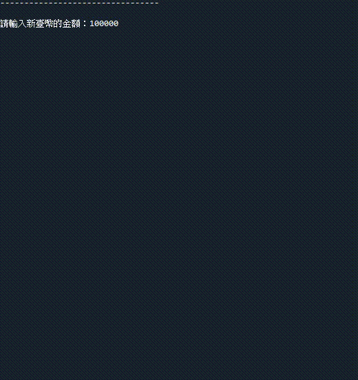

<h1 align="center">
  <br>
  [指定專題作品] 外匯資料的即時擷取 (網路爬蟲應用1)
</h1>


## 目錄
* [摘要](#摘要)
* [重點程式碼說明](#重點說明)
* [系統環境](#系統環境)
* [聯絡資料](#聯絡資料)
* [致謝](#致謝)
* [權限](#權限)


## 摘要
### 1. 本作品內含網路爬蟲相關技術 (urllib.request/bs4)，可自動擷取目前臺灣銀行之即時的外匯資料。
### 2. 主要功能為：當使用者輸入欲兌換的 (1)臺幣金額 (2)貨幣種類，即可計算出兌換後的該貨幣金額。

<strong><em>若您有興趣想更了解此程式，請參考下方的聯絡方式，進一步聯絡作者，謝謝參閱。</em></strong>


## 重點程式碼說明
### 1. 本作品內含網路爬蟲相關技術 (urllib.request/bs4)，可自動擷取目前臺灣銀行之即時的外匯資料。
* 於臺灣銀行外匯網頁，檢視網頁程式碼，找到需要擷取的類別資料，放入`find_all()`函式內
* 外匯相關資料，請參考臺灣銀行網站：https://rate.bot.com.tw/xrt?Lang=zh-TW
  ```python
  row_with_currency_names = sp.find_all(貨幣)
  cash_rates = sp.find_all(匯率)
  ```
  
* 從爬蟲獲取的外匯資料中，擷取需要的貨幣名稱和匯率
  ```python
  for index in range(len(row_with_currency_names)):
    for key in currency_rates
      ⋮
  ```
  
### 2. 主要功能為：當使用者輸入欲兌換的 (1)臺幣金額 與 (2)貨幣種類，即可計算出兌換後的該貨幣金額。
* 使用 while 迴圈達到循環輸入，並於迴圈內部，設立 3 個節點。
* 目的：若輸入錯誤，提示使用者輸入錯誤，請再輸入一次；輸入正確，則前往下個節點，最後計算並顯示結果，再回到第一個節點。
  ```python
  check_point = 1
  
  while True:
    if check_point == 1:
      ⋮
      # 若使用者輸入正確，則前往第 2 個節點
      check_point = 2
      
    elif check_point == 2:
      ⋮
      # 若使用者輸入正確，則前往第 3 個節點
      check_point = 3
      
    elif check_point == 3:
      ⋮
      print('顯示結果')
      check_point = 1
      counter += 1
  ```

* 第 1 個節點：檢查使用者輸入欲兌換的新臺幣金額
1. 使用者輸入僅限為整數或浮點數，否則顯示輸入錯誤
2. 使用者輸入的金額小於零，則顯示輸入錯誤
3. 使用者輸入 Q 或者 q，則退出程式
4. 輸入正確，則前往第 2 個節點

  

* 第 2 個節點：檢查使用者輸入欲兌換的貨幣
1. 使用者輸入僅限為整數 1 ~ 5 之間，否則顯示輸入錯誤
2. 使用者輸入若非整數，則顯示輸入錯誤
3. 輸入正確，則前往第 3 個節點

  
  
* 第 3 個節點：計算出兌換後的外幣金額
1. 計算新臺幣兌換外幣結果
2. 輸出結果
3. 輸出結果後，返回第一個節點

  


## 系統環境
### 作業系統
* OS：Windows 7 / 10 (Mac OS、Linux 系統亦可相容)

### 相關套件
* Python 核心：3.10
* Beautiful Soup：4.9


## 聯絡資料
👤 **Larry Jhuang**
  * Email: larry30500@gmail.com


## 致謝
*非常感謝指導老師 (Francesco Ke) 提供程式設計的靈感和方向，並細心指導學生編寫程式時，所需注重的細節。*

*如果您喜歡此專案，記得點擊⭐️支持作者。*


## 權限
目前設定為 MIT 權限。請參閱 `LICENSE`，了解更多相關 MIT 權限的規定。

<br><br>[返回目錄](#目錄)
